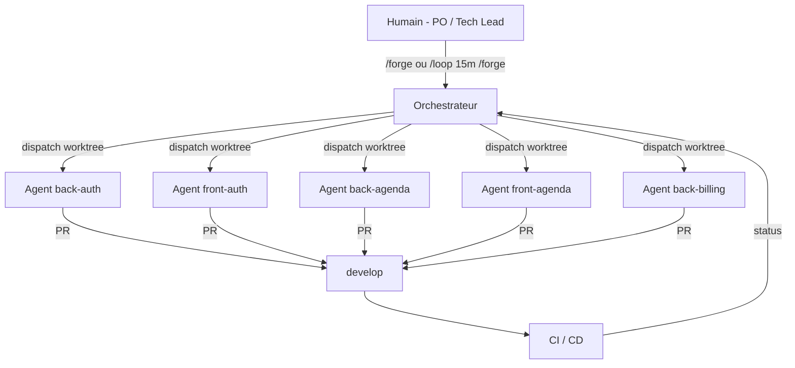
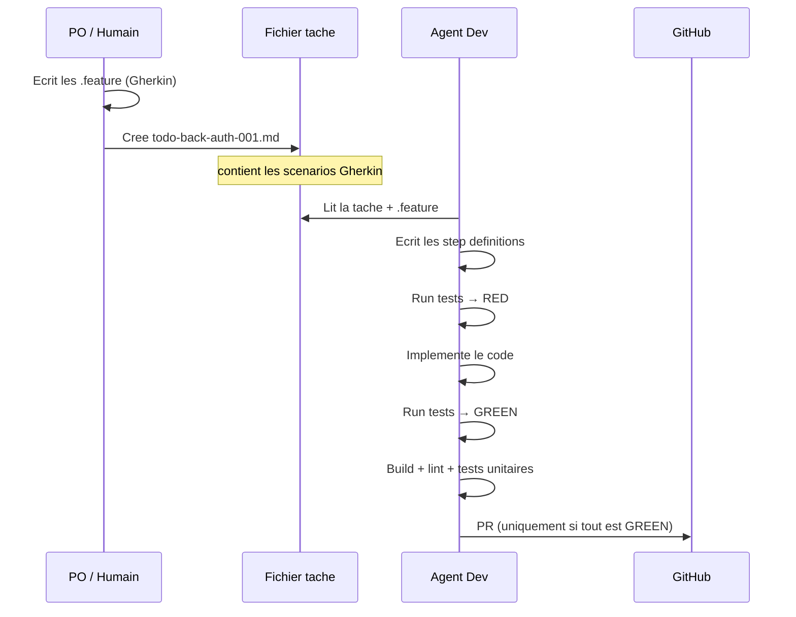
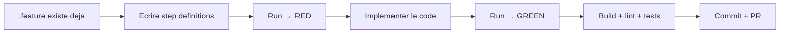
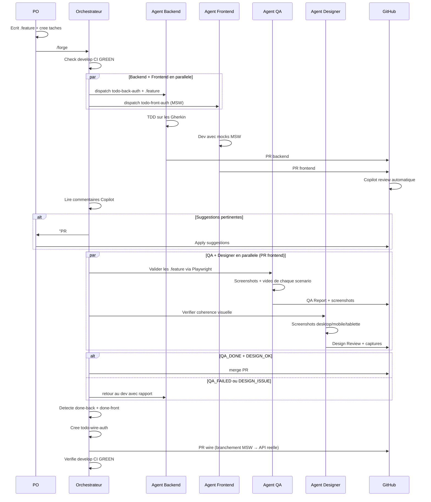
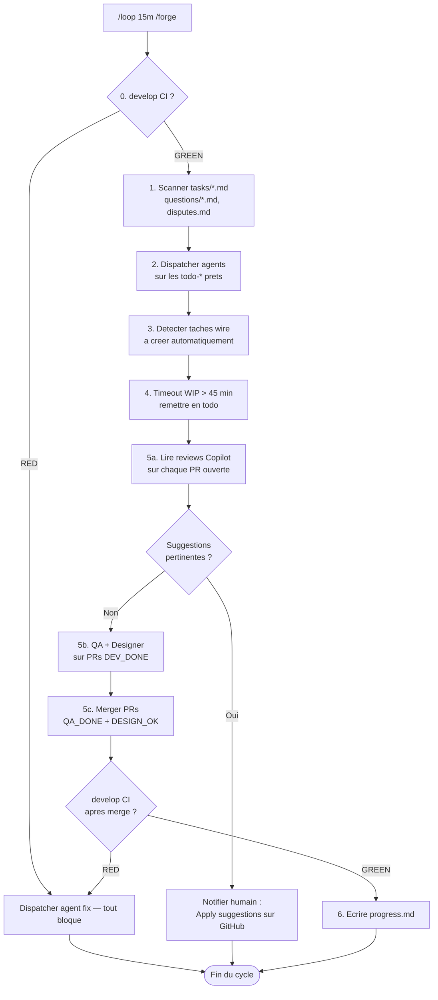
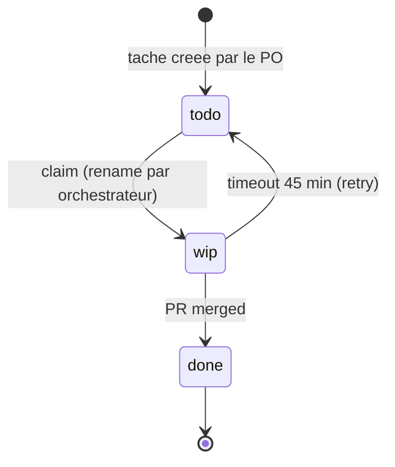
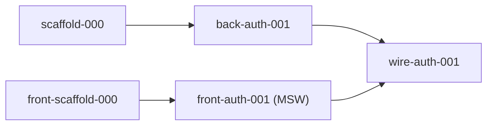
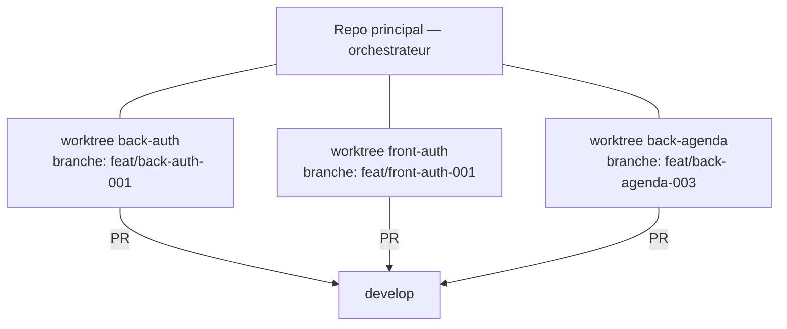
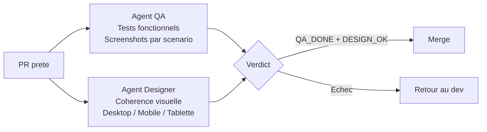

# Forge — AI-Powered Development Factory

> Process d'orchestration multi-agents pour construire un MVP avec Claude Code.
>
> **Zero trust envers les agents : chaque regle est appliquee par un mecanisme, jamais par une convention.**

---

## Pourquoi Forge ?

Developper un MVP, c'est des dizaines de modules a construire en parallele. Un seul dev (humain ou IA) met des semaines. Plusieurs agents IA sans cadre = chaos (conflits, specs ignorees, bugs invisibles).

**Forge** resout ca : un orchestrateur distribue le travail a des agents isoles, chacun livre une PR, et des garde-fous mecaniques empechent toute derive. L'humain garde le controle sur les specs et les reviews, jamais sur le code.

### Pour quel type de projet

- **MVP / v1** avec modules independants parallelisables
- **Stack bien definie** — conventions claires, pas d'improvisation
- **PO disponible** pour ecrire les specs Gherkin
- **CI/CD en place**

Pas fait pour : du legacy sans tests, de la R&D exploratoire, ou un projet solo.

### Chiffres (Vetolib MVP)

- **234+ taches** traitees en quelques jours
- **682 tests** (unitaires + integration + acceptance) — tous verts
- **10+ agents** en parallele sans conflit

---

## Vue d'ensemble



> **Takeaway :** Un orchestrateur qui ne code jamais, N agents isoles qui ne font que coder — separation totale des responsabilites.

---

## BDD-first : les Gherkin avant le code

Le PO ecrit les `.feature` (Gherkin) **avant** tout dev. L'agent les recoit et n'a qu'un objectif : les faire passer au vert.



```gherkin
Feature: Appointment booking

  Scenario: Owner books an appointment for their pet
    Given an owner with a registered pet "Luna"
    And a veterinarian with available slots on Sunday
    When the owner books a 30-minute consultation for "Luna"
    Then the appointment is confirmed
    And the owner receives a confirmation
```

- Le `.feature` est la **spec vivante** — si un scenario n'est pas couvert, c'est un bug
- L'agent ne peut pas devier : son seul critere de succes est que les tests passent
- **L'agent ne cree et ne modifie JAMAIS un .feature** — propriete exclusive du PO
- Un hook (`guard-feature.sh`) **bloque mecaniquement** toute ecriture de jargon technique dans un .feature

### Zero trust : pourquoi le hook est necessaire

Sans garde-fou mecanique, les agents derivent. Ils ecrivent `the response status is 200` au lieu de `the operation succeeds`. On s'est retrouve avec 52 status codes HTTP dans nos Gherkin. Le hook rend ca physiquement impossible.

**Principe fondamental de Forge : si une regle n'est pas appliquee par un mecanisme, elle sera violee.** Les conventions ne suffisent pas avec des agents IA. Chaque regle critique a son hook, son check CI, ou son blocage automatique.



> **Takeaway :** Le PO definit le comportement en Gherkin, l'agent le fait passer au vert — zero interpretation, zero derive.

---

## Sequence globale d'une feature



> **Takeaway :** Front et back en parallele, puis QA et Designer valident avant le merge — rien n'arrive dans develop sans preuve fonctionnelle et visuelle.

---

## La boucle (toutes les 15 min)



> **Takeaway :** La boucle tourne seule — l'humain n'intervient que sur les specs et les reviews.

---

## Systeme de taches file-based

Chaque tache est un fichier Markdown dans `tasks/`. Renommer le fichier = changer d'etat. Pas de base de donnees, juste le filesystem.



```markdown
# todo-back-auth-001.md — Implement login endpoint

**Dependances** : done-scaffold-000
**Skills** : ardalis-result, cqrs-mediatr, aspnet-minimal-api

## Gherkin
Scenario: Valid credentials grant access
  Given a registered user with email "vet@clinic.ae"
  When the user logs in with valid credentials
  Then the user is successfully authenticated

## Criteres de completion
[] Reqnroll scenarios GREEN
[] Tests unitaires + integration GREEN
[] PR creee vers develop
```



> **Takeaway :** Un rename de fichier remplace un board de tickets — simple, versionne dans git, lisible par tous.

---

## Isolation par worktree

Chaque agent travaille dans un git worktree isole. Il ne voit que les fichiers de son module.



- `sparsePaths` : seuls les dossiers necessaires sont checkout
- 1 tache = 1 branche = 1 PR (max ~30 fichiers)
- Merge only, jamais rebase (force-push interdit)

> **Takeaway :** Les worktrees isolent les agents comme des conteneurs — impossible qu'un agent casse le travail d'un autre.

---

## QA + Designer : double validation avant merge



- **Agent QA** : execute les tests Playwright headless, prend des screenshots de chaque scenario, compare le comportement a l'ecran aux .feature du PO
- **Agent Designer** : verifie le design system (shadcn/ui, tokens CSS, responsive), detecte les regressions visuelles

> **Takeaway :** Le QA verifie que ca marche, le Designer verifie que ca ressemble a ce qui est attendu — deux filets complementaires.

---

## Garde-fous (zero trust)

| Mecanisme | Declencheur | Effet |
|---|---|---|
| Gherkin obligatoire | Avant tout dev | Pas de .feature = pas de code |
| `guard-feature.sh` | Ecriture dans un .feature | Bloque le jargon technique |
| `verify-before-push.sh` | `git push` | Build + tests doivent passer |
| `guard-shared.sh` | Ecriture dans `Shared/` | Bloque — fichiers geles |
| Copilot review | PR ouverte | Review automatique avant merge |
| Agent QA | PR `DEV_DONE` | Tests Playwright + screenshots |
| Agent Designer | PR frontend `DEV_DONE` | Coherence design system |
| `PostCompact` hook | Compaction contexte | Detection agents zombies |
| WIP timeout | Cycle orchestrateur | Remet en todo apres 45 min |
| `log-cost.sh` | Fin de session | Alerte si > $2 par session |

> **Takeaway :** Aucune regle ne repose sur la bonne volonte d'un agent. Chaque regle a un mecanisme qui l'applique.

---

## Commandes

| Commande | Quand | Effet |
|---|---|---|
| `/kickoff` | Debut de projet | Le PO agent construit le backlog complet via Q&A |
| `/forge` | En continu | Cycle orchestrateur complet |
| `/loop 15m /forge` | En continu | Cycle auto toutes les 15 min (expire apres 3j) |
| `/status` | A tout moment | Etat rapide en < 10 lignes |
| `/dev tasks/todo-xxx.md` | Manuel | Lancer un agent dev sur une tache |
| `/po` | Quand bloque | Traiter les questions metier en attente |

---

## Principes

1. **L'orchestrateur ne code jamais** — il coordonne, dispatch, merge, surveille
2. **BDD-first** — les .feature existent AVANT le code, c'est le contrat de l'agent
3. **Zero trust** — chaque regle est appliquee par un hook, un check CI, ou un blocage automatique
4. **Parallelisme maximum** — autant d'agents que de taches pretes, front et back en parallele
5. **MSW-first** — le frontend n'attend jamais le backend
6. **Isolation par worktree** — chaque agent dans son conteneur git
7. **Atomicite file-based** — rename de fichier = transition d'etat
8. **develop GREEN = invariant** — si CI est RED, tout est bloque
9. **1 tache = 1 branche = 1 PR** — squash merge, max ~30 fichiers
10. **Fail-fast** — en cas de doute, l'agent se bloque et ecrit dans `questions/`

---

*Copyright 2026 Yannis TOCREAU. Tous droits reserves.*
*Ce document et le process Forge qu'il decrit sont la propriete intellectuelle de Yannis TOCREAU. Toute reproduction, distribution ou utilisation commerciale, en tout ou partie, est interdite sans autorisation ecrite prealable.*
